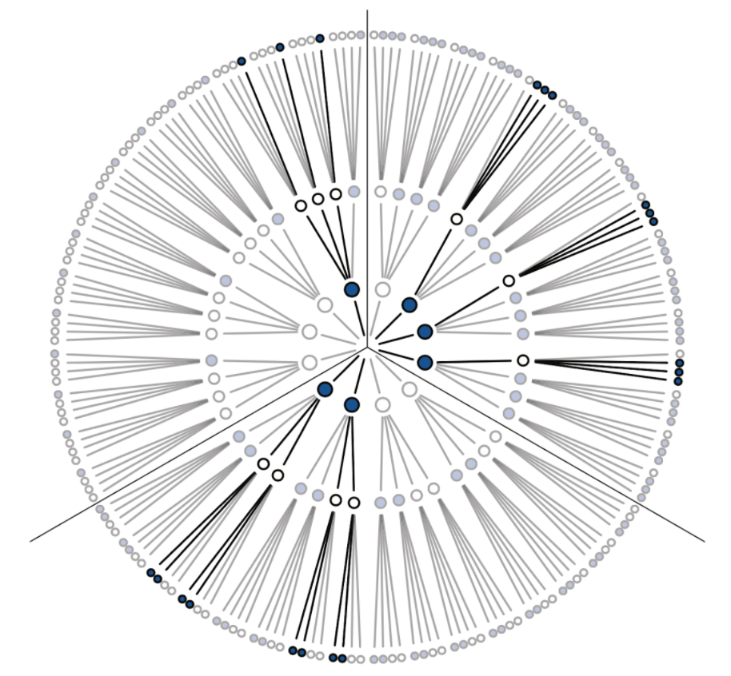
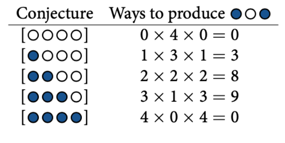
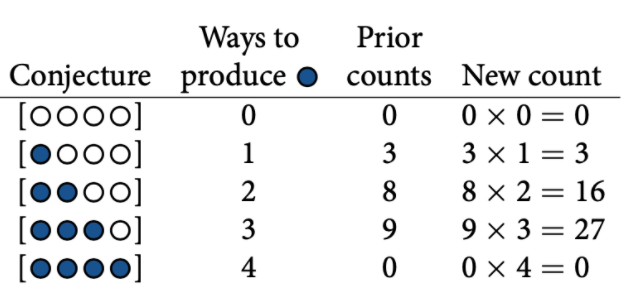

# Chapter 2:

* Bayesian is expensive and depends upon having a good model.

* Principle of indifference: is to weight all conjectures equally. The structure of the model and the scientific context always provide information that allow us to do better than ignorance. 

* Unobservable variables are often called parameters.

* A distribution function assigned to an observed variable is usually called a likelihood.

* Bayesian inference is really just counting the number of possible outcomes that are consistent with the data and updating them as new data appears:

    * Given a conjecture (an hypothesis), bayesian inference just count the relative possible ways that the conjecture could produce the data.

In this trivial example we have a bag with four marbles. These marbles come in two colors: blue and white. We know there are four marbles in the bag, but we don’t know how many are of each color. We make some observations. We take a marble from the bag, take note of it’s color and then we put the marble in the bag again. We shuffle the marbles in the bag and repeat the process 3 times. The sequence obtained from this experiment is blue-white-blue. 
The possible arrangement of the marbles inside the bag is calculated like so:

As we can see, the number of ways to produce the data, for each conjecture, can be computed by first counting the number of paths in each “ring” and then by multiplying these counts together. 

Model updating: Now we can acquire new data, so the logical way to add it to our model is to count the number of ways the data (old and new) could be generated by the different conjectures. Suppose that a new blue marble is taken:

So, if we want to obtain the probability of each conjecture given the data:

Prob(conj-1) = 0 (as we saw blue marble, there must be at least one)
Prob(conj-2) = 3/(3+16+27) =  0.065
Prob(conj-3) = 16/(3+16+27) =  0.35
Prob(conj-4) = 27/(3+16+27) =  0.585
Prob(conj-5) = 0

$Pr(p|W, L) = \frac{Pr(W,L|p)Pr(p)}{Pr(W,L)}$

This says that the probability of any particular value of p, considering the data, is equal to the product of the relative plausibility of the data, conditional on p, and the prior plausibility of p, divided by this thing Pr(W, L), which I’ll call the average probability of the data. This average is  done over all possible likelihood distributions with the different possibilities given by the prior.

$Posterior = \frac{\textrm{Probability of the data x Prior}}{\textrm{Average probability of the data}}$

The key lesson is that the posterior is proportional to the product of the prior and the probability of the data. Why? Because for each specific value of p, the number of paths through the garden of forking data is the product of the prior number of paths and the new number of paths. Multiplication is just compressed counting. The average probability on the bottom just standardizes the counts so they sum to one.

Numerical techniques for computing posterior distributions used in the book:
   * Grid approximation			
   * Quadratic approximation				
   * Markov chain Monte Carlo (MCMC) 	