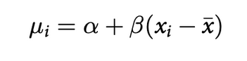

# Chapter 4:
- General approach for building a model:
1- Recognize the set of variables we are going to work with. The observable ones are called data, the unobservable ones, such as means or rates, are called parameters.
2- Each variable is defined in terms of a probability distribution or in terms of other variables.
3- The combination of variables and their probability distributions defines what it called a *joint generative model*. It can be used to simulate hypothetical observations or to analyze real ones.
- The Gaussian is a member of a family of fundamental natural distributions known as the exponential family. All of the members of this family are important for working science, because they populate our world.
- Using Gaussian distributions:
    - Ontological justification: the world is full of Gaussian distributions, approximately.
    - By the epistemological justification, the Gaussian represents a particular state of ignorance. When all we know or are willing to say about a distribution of measures (measures are continuous values on the real number line) is their mean and variance, then the Gaussian distribution arises as the most consistent with our assumptions.
- The linear model strategy: the strategy is to make the parameter for the mean of a Gaussian distribution, μ, into a linear function of the predictor variable x and other new parameters that we build.  The relationship between the mean and the other variables is deterministic, not stochastic.
- The mean μ is no longer a parameter to be estimated. Rather, μi is constructed from other parameters, α and β, and the observed variable x. This line is not a stochastic relationship—there is no ∼ in it, but rather an = in it because the definition of μi is deterministic. That is to say that, once we know α and β and xi, we know μi with certainty.

What this tells the regression model is that you are asking two questions about the mean of the outcome:
    - What is the expected height when xi =  ̄x? The parameter α answers this question, because when xi =  ̄x, μi = α. For this reason, α is often called the intercept. But we should think not in terms of some abstract line, but rather in terms of the meaning with respect to the observable variables.
    - What is the change in expected height, when xi changes by 1 unit? The parameter β answers this question. It is often called a “slope,” again because of the abstract line. Better to think of it as a rate of change in expectation.
- There is nothing really special about linear models. We may have chosen another deterministic relationship between the mean and the other variables.
- Bayesian updating allows us to consider all possible combinations of values that our variables could possibly take. It weighs the values with their plausibility, in light of the data. These relative plausibilities are the posterior probabilities of each combination of the variables in the model.
- Prior predictive simulation is an essential part of the modeling process. It's very useful for assigning sensible priors, because it can be hard to anticipate how priors influence the observable variables.
- If we have a huge amount of data, uninformative priors are harmless, but there are plenty of inference problems for which the data alone are not sufficient, no matter how numerous. Bayes lets us proceed in these cases. But only if we use our scientific knowledge to construct sensible priors. Also, there are many analyses in which no amount of data makes the prior irrelevant.
- It's important that your prior not be based on the values in the data, but only on what you know about the data before you see it.
- Exponential distributions are useful priors for scale parameters, parameters that must be positive. Epistemologically, it is the optimal distribution for describing a random variable whose average deviation is the only information we got.
