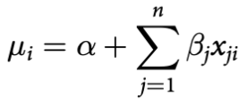
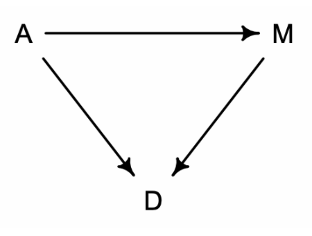

## Chapter 5
- Since most correlations do not indicate causal relationships, we need tools for distinguishing mere association from evidence of causation. This is why so much effort is devoted to **multiple regression**, using more than one predictor variable to simultaneously model an outcome. Reasons given for multiple regression models include:
    - To emulate multiple and complex causation
    - To model interactions: The importance of one variable may depend upon another. Such interactions occur very often. Effective inference about one variable will often depend upon consideration of others.
-   The general formula for a multiple linear regression features a new relation between the mean of the Gaussian distribution and the predictor variables $x_{j}$:

      
    
-  The defining question of multiple regression is: What is the value of knowing each predictor, once we already know the other predictors?
-  There are two valuable things these models can help us with: (1) revealing spurious correlations and (2) revealing important correlations that may be masked by unrevealed correlations with other variables.
-  A DAG, short for Directed Acyclic Graph, is a way of describing causal relationships among variables:
    

    What this DAG says is:
    - A directly influences D				
    - M directly influences D
    - A directly influences M 

- In general, it is possible that a variable like A has no direct effect at all on an outcome like D. It could still be associated with D entirely through the indirect path. That type of relationship is known as **mediation**.	
- To test the above implications, we need a statistical model that conditions on A, so we can see whether that renders D independent of M. And that is what multiple regression helps with. It can address a useful descriptive question: Is there any additional value in knowing a variable, once I already know all of the other predictor variables?

- **Multivariate posterior plots**: In a simple bivariate regression, there is only one predictor variable so a single scatter plot can give us a lot of information. With multivariate regression, you’ll need more plots to capture the richness and complexity of the model. Three examples given in the book of this plots are:
	- Predictor residual plots: They show the outcome against residual predictor values. They are useful for understanding the statistical model.
	- Posterior prediction plots: They show model-based predictions against raw data or display error in prediction.
	- Counterfactual plots: They show the implied prediction for imaginary experiments.  They allow you to explore the causal implications of manipulating one or more variables.

**Categorical data**:
- Indicator variables —sometimes also called “dummy” variables— are devices for encoding unordered categories into quantitative models. Use the indicator variable directly inside the linear model, as if it were a typical predictor variable. The effect of an indicator variable is to turn a parameter on for those cases in the category. Simultaneously, the variable turns the same parameter off for those cases in another category. If you have k unique categories, you need k − 1 indicator variables.
- Another approach available to us is an index variable. An index variable contains integers that correspond to different categories. The integers are just names, but they also let us reference a list of corresponding parameters, one for each category.

